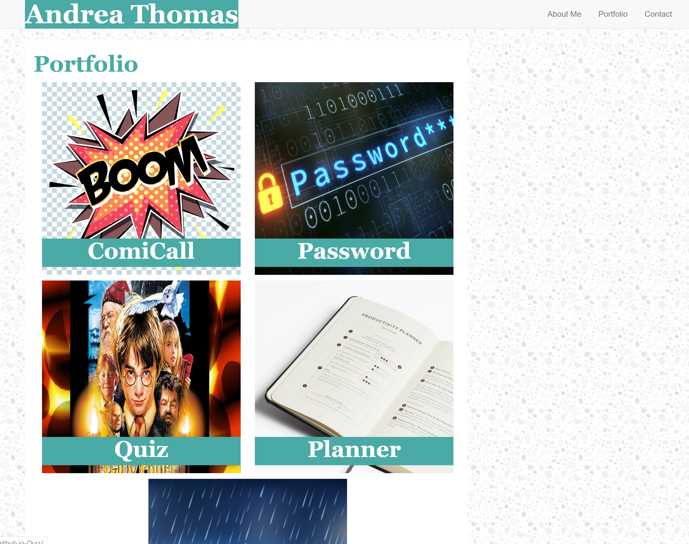

# Portfolio

##Table of Contents

* [Description](#description)
* [Screenshot](#shreenshot)
* [Components](#components)
* [Deployment](#deployment)
* [Technologies Used](#technologies-used)
* [Status](#status)
* [Author](#author)
* [License](#license)

## Description

The purpose of this website is to showcase a personal profile with content highlighting creative achievements alongside a brief personal summary.
There is an option to contact the person to whom the portfolio belongs.  
The site also demonstrates the utiliztion of the Bootstrap CSS Framework. 
This portfolio site is formatted to be responsive to multiple viewports. 

## Screenshot

## Components

The portfolio is comprised of three pages:

1. About Me
2. Portfolio
3. Contact

* CSS files with non-Bootstrap media queries are included

## Deployment

Webpage can be found at this link: https://github.com/andreathomas19460/BootstrapPortfolio.git

## Technologies Used

* Bootstrap (version 4)
* GitHub Pages

## Status

In progress

## Author

Andrea Thomas

## License 

This project is licensed under the GNU General Public License. See the gnuLICENSE.md for details. 

